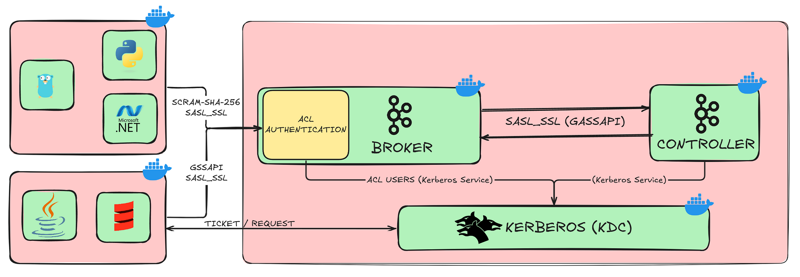
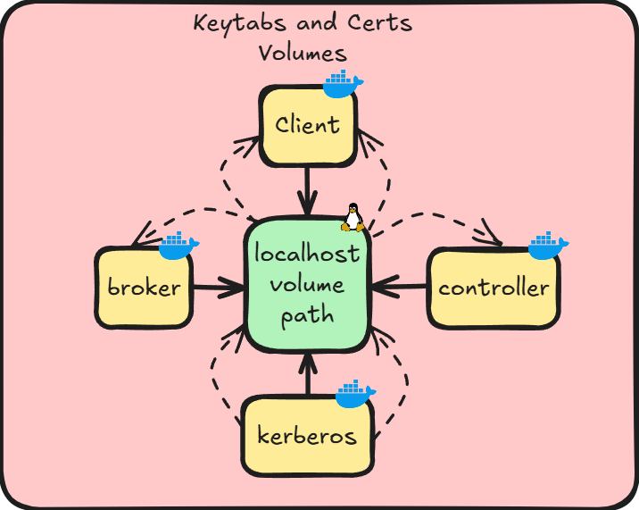

# Securing a Split KRaft Kafka Architecture: Setting Up Kerberos and SCRAM Authentication

In this demo, the main aim is to implement a split KRaft Kafka Cluster with separate controller and broker components. When authentication is added to the `*.properties` files, the split architecture can cause confusion, which is why I've set up `GSSAPI authentication` between the controller and broker. Additionally, a client container is included that uses both `Kerberos and SCRAM authentication` with the broker. For a deeper understanding of configuration, properties files, and `Kerberos/SCRAM authentication`, please refer to the accompanying `medium article`.

Medium Article: https://medium.com/@mucagriaktas/securing-a-split-kraft-kafka-architecture-setting-up-kerberos-and-scram-authentication-665f310ec306



### 🛠️ Environment Setup
| Software          | Description                                    | Version                             | UI - Ports      |
|-------------------|------------------------------------------------|-------------------------------------|------------|
| **WSL**           | Windows Subsystem for Linux environment        | Ubuntu 22.04 (Distro 2)             |            |
| **Docker**        | Containerization platform                      | Docker version 27.2.0               |            |
| **Docker Compose**| Tool for defining and running multi-container Docker applications | v2.29.2-desktop.2 |            |
| **Apache Kafka**  | Distributed event streaming platform           | 3.8.0                               | 9092 (broker), 9093 (controller) |
| **Kerberos**      | Network authentication protocol service        | MIT Kerberos version 1.19.2-2ubuntu0.5 | 88/udp (KDC), 749/tcp (kadmin) |
| **Python**        | Programming language                           | 3.9.2                               |            |
| **Scala**         | Programming language                           | 2.10.20                             |            |

# 🛠️ How to Start The Project
1. Clone the project:
```bash
git clone https://github.com/mcagriaktas/split_kraft_kafka_with_kerberos_scram.git
```

2. Start `init-docker-compose.yml` for deploying logs, metadatas and configs files:
```bash
./init-docker-compose.yml
```

3. Build the images:
```bash
docker-compose up -d --build
```

### How to create Keytabs and Scrum Users for Client:
When you build and start the project, you can `ONLY USE CLIENT` container, ofc. if you wish you can add other client container and use too but don't forget, you need to add your new container extra_host, `kerberos and broker` hostname and ipaddress.

You can simply use `./add_users.sh` for create topic, consumer-group, scrum user, keytabs and more. When you create keytabs you'll see the keytabs in the `configs/keytabs/client-keytabs` because these volume path is partner with kerberos and client container, in this reason when you create new keytab, the keytab will be in the path. 


Also when you want to compile a jar or write a new scrip, you can put your file in `/configs/client/scala or python`

client volume:
```bash
      - ./configs/client:/mnt/home
```



### DeepNote [1]
Note: If you want to run Kafka 3.9.0, you need to add controller.advertised.listener. Before Kafka 3.9.0, this was not required, but starting from version 3.9.0 and in future releases, Kafka explicitly requires it.

### Thanks for Helping and Contributing
## `Can Sevilmis & Bunyamin Onum & B. Can Sari`
